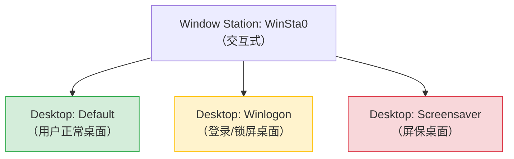
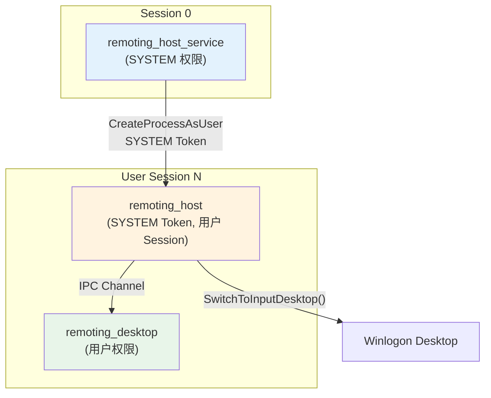
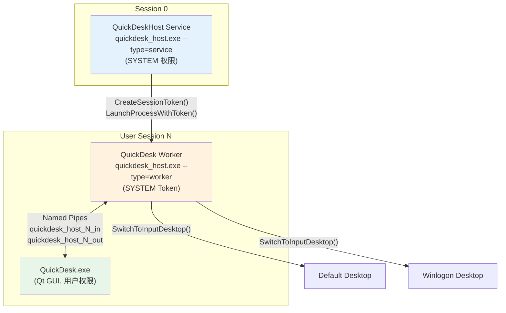
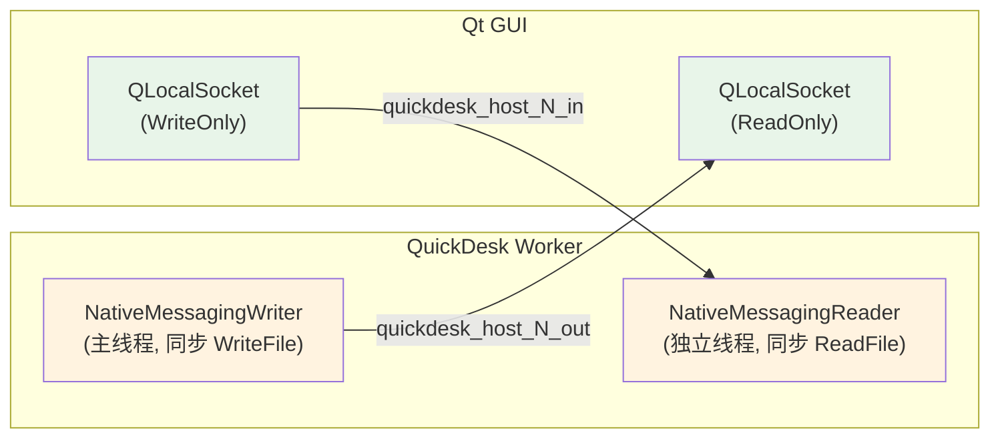
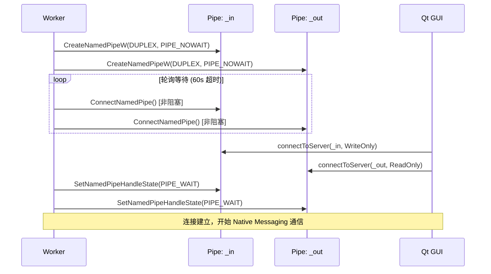

# Windows 支持锁屏控制技术方案

> **文档状态**：已实现  
> **最后更新**：2026-03-03  
> **作者**：QuickDesk Team

---

## 1. 背景与问题定义

### 1.1 问题描述

远程桌面控制软件在 Windows 平台上普遍面临一个核心问题：**当被控端用户锁屏（Win+L）或屏幕保护激活后，远程端无法继续查看画面和操作被控端**。具体表现为：

- 远程端画面冻结在锁屏前的最后一帧
- 键盘鼠标输入无法传递到锁屏界面
- 远程用户无法输入密码解锁电脑
- 必须依赖现场人员物理解锁

这一问题的根因在于 Windows 的**桌面安全隔离架构**。

### 1.2 Windows 桌面安全架构

Windows 采用 **Window Station → Desktop** 两级隔离模型：



| Desktop | 何时激活 | 安全要求 |
|---------|---------|---------|
| `Default` | 用户正常登录后 | 当前用户 Token 即可访问 |
| `Winlogon` | 锁屏、Ctrl+Alt+Del、UAC 弹窗 | 需要 **SYSTEM 权限** 才能访问 |
| `Screensaver` | 屏保激活时 | 需要 SYSTEM 权限 |

**关键限制**：普通用户权限的进程只能访问 `Default` 桌面。当系统切换到 `Winlogon` 桌面时，以用户权限运行的远程控制进程无法：

1. **捕获画面** —— `BitBlt`/DXGI/WGC 等截屏 API 只能捕获当前线程所在 Desktop 的内容
2. **注入输入** —— `SendInput`/`mouse_event` 等 API 只能向当前线程所在 Desktop 发送事件
3. **切换 Desktop** —— `OpenInputDesktop()` + `SetThreadDesktop()` 需要目标 Desktop 的访问权限，`Winlogon` 桌面只对 SYSTEM 开放

### 1.3 核心矛盾

| 需求 | 约束 |
|------|------|
| 远程端在锁屏后仍能看到画面和操作 | 需要访问 `Winlogon` Desktop |
| 访问 `Winlogon` Desktop | 需要 SYSTEM 权限 Token |
| 获取 SYSTEM 权限 Token | 需要 Windows Service（Session 0） |
| Windows Service 运行在 Session 0 | 无法直接访问用户 Session 的 Desktop |

因此，解决方案必须同时满足：**SYSTEM 权限** + **用户 Session 上下文**。

---

## 2. 竞品方案调研

### 2.1 主流远程控制软件架构对比

| 产品 | 架构模式 | Service 角色 | 锁屏支持 | 核心技术 |
|------|---------|-------------|---------|---------|
| **TeamViewer** | Service + Agent | `TeamViewer_Service.exe` 以 SYSTEM 运行，启动 `TeamViewer.exe` Agent | 完整支持 | Service 将 SYSTEM Token 注入 Agent 进程 |
| **AnyDesk** | Service + Worker | `AnyDesk.exe --service` 以 SYSTEM 运行，在用户 Session 启动 Worker | 完整支持 | `CreateProcessAsUser` + Session Token |
| **Sunlogin（向日葵）** | Service + Client | `SunloginClient.exe` 有 Service 组件 | 完整支持 | Service 模式下以 SYSTEM 权限运行 |
| **ToDesk** | Service + Agent | `ToDesk_Service.exe` 常驻后台 | 完整支持 | Service 在用户 Session 启动 Agent |
| **Chrome Remote Desktop** | Service + Host + Desktop Process | 三进程架构 | 完整支持 | `remoting_host_service` → `remoting_host` → `remoting_desktop` |
| **RustDesk** | Service + Main | 可选 Service 模式 | Service 模式下支持 | 类似 TeamViewer 架构 |

### 2.2 行业共识

所有支持锁屏控制的远程桌面软件都采用了**相同的核心架构**：

> **SYSTEM 权限 Windows Service** 在后台常驻 → 在用户 Session 中启动**拥有 SYSTEM Token 的工作进程** → 工作进程调用 `SwitchToInputDesktop()` 跟随桌面切换

差异仅在于进程数量（2 进程 vs 3 进程）和 IPC 方式（Named Pipe / TCP / COM）。

### 2.3 Chrome Remote Desktop 参考架构（三进程模型）

Chrome Remote Desktop 使用三进程架构来处理 Windows 锁屏场景：



- `remoting_host_service`：Session 0 Service，负责启动 Host
- `remoting_host`：核心进程，SYSTEM Token，处理 WebRTC 连接和桌面切换
- `remoting_desktop`：用户态进程，处理 UI 交互（断开按钮、通知等）

---

## 3. QuickDesk 解决方案

### 3.1 架构设计

QuickDesk 采用**精简的两进程架构**（对比 Chrome Remote Desktop 的三进程），在保证功能完整性的同时降低了系统复杂度：



### 3.2 进程职责

| 进程 | 权限 | Session | 职责 |
|------|------|---------|------|
| **QuickDeskHost Service** | SYSTEM | Session 0 | 系统启动时自动运行；监听 Session 变化事件；在用户 Session 中启动 Worker 进程 |
| **QuickDesk Worker** | SYSTEM Token | 用户 Session | 创建 Named Pipe 等待 GUI 连接；运行 ChromotingHost 处理远程连接；调用 `SwitchToInputDesktop()` 跟随桌面切换 |
| **QuickDesk.exe (Qt GUI)** | 当前用户 | 用户 Session | 用户交互界面；通过 Named Pipe 连接 Worker；发送控制指令（connect/disconnect） |

### 3.3 为什么选择两进程而非三进程

| 对比维度 | Chrome 三进程 | QuickDesk 两进程 |
|---------|-------------|-----------------|
| Service 进程 | `remoting_host_service` | `QuickDeskHost Service` |
| 核心工作进程 | `remoting_host` | `QuickDesk Worker` |
| UI 进程 | `remoting_desktop`（Chromium 原生 UI） | `QuickDesk.exe`（Qt GUI） |
| IPC 链路 | Service ↔ Host ↔ Desktop（两段 IPC） | Service → Worker ↔ GUI（一段 IPC） |
| 复杂度 | 需要维护两条 IPC 通道和三个进程生命周期 | 仅需维护一条 IPC 通道和两个进程生命周期 |

QuickDesk 将 Chrome 的 `remoting_host` 和 `remoting_desktop` 的职责合并到 Worker + Qt GUI 中，Qt GUI 承担了 UI 职责，Worker 承担了核心远程控制职责，两者通过 Named Pipe 通信，简化了整体架构。

---

## 4. 核心实现

### 4.1 Service 层：会话感知与进程管理

Service 通过 `RegisterServiceCtrlHandlerExW` 注册控制处理器，监听系统会话变化事件：

```cpp
// quickdesk_service_win.cc
case SERVICE_CONTROL_SESSIONCHANGE: {
    WTSSESSION_NOTIFICATION* info = (WTSSESSION_NOTIFICATION*)event_data;
    switch (event_type) {
        case WTS_SESSION_LOGON:
            LaunchWorker(info->dwSessionId);   // 用户登录 → 启动 Worker
            break;
        case WTS_SESSION_LOGOFF:
            StopWorker();                       // 用户注销 → 停止 Worker
            break;
    }
}
```

**Worker 启动流程**：

1. `CreateSessionToken(session_id)` — 复制 SYSTEM Token 并修改 SessionId
2. 构造命令行 `--type=worker --pipe-name=quickdesk_host_<session_id>`
3. `LaunchProcessWithToken()` — 在 `winsta0\default` 桌面启动进程

**Token 创建关键步骤（`launch_process_with_token.cc`）**：

```
CopyProcessToken(SYSTEM Token)
    → CreatePrivilegedToken(SE_TCB_NAME)
        → ImpersonateLoggedOnUser()
            → SetTokenInformation(TokenSessionId = target_session)
                → RevertToSelf()
```

最终 Worker 进程拥有 **SYSTEM 权限** 但运行在 **用户 Session** 中，这是访问 `Winlogon` 桌面的前提条件。

### 4.2 Worker 层：双管道 IPC 与桌面切换

#### 4.2.1 Named Pipe 设计

Worker 创建两个独立的 Named Pipe 实例与 Qt GUI 通信：

| Pipe 名称 | 方向 | 用途 |
|-----------|------|------|
| `quickdesk_host_<sid>_in` | GUI → Worker | GUI 发送控制指令（connect、disconnect） |
| `quickdesk_host_<sid>_out` | Worker → GUI | Worker 推送状态更新（hostReady、clientConnected） |

**为什么需要两个 Pipe？**

`NativeMessagingReader` 在独立线程上执行同步阻塞式 `ReadFile`。如果读写共用一个 Pipe 实例，Windows 的同步 I/O 会对同一 Pipe 实例的所有操作进行序列化——`ReadFile` 阻塞期间，主线程的 `WriteFile` 也会被阻塞，导致消息无法发出。

分离为两个 Pipe 后，读写互不干扰。

#### 4.2.2 非阻塞连接机制

Worker 使用 `PIPE_NOWAIT` 模式创建 Pipe，通过轮询实现非阻塞等待 GUI 连接：

```
创建 Pipe (PIPE_NOWAIT + 重试机制)
    → 轮询 ConnectNamedPipe (两个 Pipe 并行等待, 60s 超时)
        → 切换 PIPE_WAIT (阻塞模式用于后续读写)
```

重试机制处理了 Service 卸载重装后旧 Pipe 实例残留的场景。

#### 4.2.3 桌面切换核心逻辑

```cpp
// session_input_injector.cc
void SessionInputInjectorWin::Core::SwitchToInputDesktop() {
    std::unique_ptr<webrtc::Desktop> input_desktop(
        webrtc::Desktop::GetInputDesktop());       // OpenInputDesktop()
    if (input_desktop && !desktop_.IsSame(*input_desktop)) {
        desktop_.SetThreadDesktop(input_desktop.release());  // SetThreadDesktop()
    }
}
```

该方法在**每次输入事件注入前**调用，确保输入始终发送到当前接收输入的桌面：

- 正常状态：`GetInputDesktop()` → `Default` → 输入发到用户桌面
- 锁屏状态：`GetInputDesktop()` → `Winlogon` → 输入发到锁屏界面
- 解锁后：`GetInputDesktop()` → `Default` → 自动切回用户桌面

整个切换过程对远程用户完全透明，无需重连。

### 4.3 Qt GUI 层：纯 Qt API 通信

Qt GUI 通过 `QLocalSocket` 连接 Worker 的 Named Pipe，完全使用 Qt 框架 API，不涉及原生 Win32 调用：

```cpp
// ProcessManager.cpp
m_hostWriteSocket->connectToServer(writePipeName, QIODevice::WriteOnly);
m_hostReadSocket->connectToServer(readPipeName, QIODevice::ReadOnly);

m_hostMessaging = std::make_unique<NativeMessaging>(
    m_hostReadSocket.get(), m_hostWriteSocket.get(), this);
```

GUI 与 Worker 之间采用 **Native Messaging 协议**（4 字节小端序长度前缀 + JSON 正文），与 Chrome Extension Native Messaging 协议一致。

---

## 5. 完整生命周期

以下时序图展示了从系统启动到用户注销的完整交互流程：

```mermaid
sequenceDiagram
    participant OS as Windows OS
    participant SCM as Service Control Manager
    participant SVC as QuickDeskHost Service<br/>(Session 0, SYSTEM)
    participant WKR as quickdesk_host.exe<br/>--type=worker<br/>(User Session, SYSTEM Token)
    participant GUI as QuickDesk.exe (Qt GUI)<br/>(User Session, 用户权限)
    participant Client as 远程 Client

    Note over OS,Client: ═══ 阶段1：系统启动 ═══

    OS->>SCM: 系统启动
    SCM->>SVC: StartService (SERVICE_AUTO_START)
    activate SVC
    SVC->>SVC: RegisterServiceCtrlHandlerEx<br/>(监听 STOP / SHUTDOWN / SESSIONCHANGE)
    SVC->>SVC: WTSGetActiveConsoleSessionId()

    alt 用户已登录 (session ≠ 0xFFFFFFFF)
        SVC->>SVC: CreateSessionToken()<br/>复制 SYSTEM Token → 修改 SessionId
        SVC->>WKR: LaunchProcessWithToken<br/>(winsta0\default, SYSTEM Token)
        activate WKR
        WKR->>WKR: CreateNamedPipeW × 2<br/>(quickdesk_host_{sid}_in / _out)
        WKR->>WKR: ConnectNamedPipe() — 轮询等待 GUI
        Note right of WKR: Worker 以 SYSTEM 身份<br/>运行在用户 Session<br/>拥有访问所有 Desktop 的权限
    else 无用户登录
        Note over SVC: 等待 WTS_SESSION_LOGON
    end

    Note over OS,Client: ═══ 阶段2：用户登录 ═══

    OS->>SVC: WTS_SESSION_LOGON (session_id)
    SVC->>SVC: CreateSessionToken(session_id)
    SVC->>WKR: LaunchProcessWithToken(SYSTEM Token)
    activate WKR
    WKR->>WKR: CreateNamedPipeW × 2 + ConnectNamedPipe()

    Note over OS,Client: ═══ 阶段3：Qt GUI 启动 ═══

    GUI->>GUI: 用户启动 QuickDesk.exe
    activate GUI
    GUI->>GUI: ProcessManager::startHostProcess()
    GUI->>GUI: isHostServiceInstalled() → 检测 Service 状态

    alt Service 运行中
        GUI->>GUI: connectToHostService()
        GUI->>WKR: QLocalSocket::connectToServer(_in, WriteOnly)
        GUI->>WKR: QLocalSocket::connectToServer(_out, ReadOnly)
        WKR-->>WKR: ConnectNamedPipe() 返回 ✓
        WKR-->>GUI: Pipe 连接建立
        GUI->>GUI: 创建 NativeMessaging(readSocket, writeSocket)
        GUI->>WKR: {"type":"connect", "signalingUrl":"ws://...", ...}
        WKR->>WKR: QuickDeskHost::Connect()
        WKR-->>GUI: {"type":"hostReady", "deviceId":"xxx"}
    else Service 未安装
        GUI->>WKR: QProcess::start("quickdesk_host.exe")<br/>⚠️ 以用户权限启动（无法操作锁屏）
    end

    Note over OS,Client: ═══ 阶段4：远程客户端连接 ═══

    Client->>WKR: 通过 Signaling Server 建立 WebRTC 连接
    WKR-->>GUI: {"type":"clientConnected", "clientId":"..."}
    Note over WKR: ChromotingHost 开始<br/>屏幕捕获 + 输入注入<br/>SessionInputInjectorWin 活跃

    Note over OS,Client: ═══ 阶段5：用户锁屏 ═══

    OS->>OS: 用户按 Win+L 或超时锁屏
    Note over OS: Desktop 切换:<br/>winsta0\default → winsta0\Winlogon

    rect rgb(255, 245, 230)
        Note over SVC,WKR: ⚡ 关键：无进程重启，无 Session 变化
        Note over SVC: Service 无事发生<br/>(锁屏 ≠ LOGOFF)
        Note over WKR: Worker 继续运行<br/>(同一 Session，同一进程)
        WKR->>WKR: SwitchToInputDesktop()
        WKR->>WKR: GetInputDesktop() → Winlogon
        WKR->>WKR: SetThreadDesktop(Winlogon)
        Note over WKR: ✅ 屏幕捕获: Winlogon 桌面<br/>✅ 输入注入: Winlogon 桌面<br/>✅ 远程用户可以看到锁屏<br/>✅ 远程用户可以输入密码
    end

    Client->>WKR: 远程输入密码解锁

    Note over OS,Client: ═══ 阶段6：用户解锁 ═══

    OS->>OS: 密码验证通过，解锁
    Note over OS: Desktop 切换:<br/>winsta0\Winlogon → winsta0\default

    rect rgb(230, 255, 230)
        WKR->>WKR: SwitchToInputDesktop()
        WKR->>WKR: GetInputDesktop() → Default
        WKR->>WKR: SetThreadDesktop(Default)
        Note over WKR: ✅ 自动切回用户桌面<br/>✅ 远程控制无缝恢复
    end

    Note over OS,Client: ═══ 阶段7：Qt GUI 退出 ═══

    GUI->>GUI: 用户关闭 QuickDesk
    GUI->>WKR: disconnectFromServer()
    deactivate GUI

    WKR->>WKR: ReadFile() → ERROR_BROKEN_PIPE
    WKR->>WKR: QuickDeskHost::Disconnect()
    WKR->>WKR: 进程退出 (exit 0)
    deactivate WKR

    SVC->>SVC: 检测到 Worker 退出
    SVC->>SVC: Sleep(2000) → 重启 Worker
    SVC->>WKR: LaunchWorker() → 新 Worker
    activate WKR
    WKR->>WKR: CreateNamedPipeW × 2 + ConnectNamedPipe()
    Note right of WKR: 新 Worker 就绪<br/>等待下一次 GUI 连接

    Note over OS,Client: ═══ 阶段8：Qt GUI 再次启动 ═══

    GUI->>GUI: 用户再次启动 QuickDesk
    activate GUI
    GUI->>WKR: connectToServer(_in / _out)
    WKR-->>GUI: Pipe 连接建立
    GUI->>WKR: {"type":"connect", ...}
    Note over GUI,WKR: 恢复正常工作

    Note over OS,Client: ═══ 阶段9：用户注销 ═══

    OS->>SVC: WTS_SESSION_LOGOFF (session_id)
    SVC->>WKR: StopWorker() → TerminateProcess()
    deactivate WKR
    deactivate GUI
    Note over SVC: Service 继续运行<br/>等待下一次 WTS_SESSION_LOGON
    deactivate SVC
```



---

## 6. Named Pipe IPC 设计详解

### 6.1 协议格式

采用 Chrome Native Messaging 协议，二进制安全，无换行符歧义：

```
┌──────────────────┬─────────────────────────┐
│ Length (4 bytes)  │ JSON Body (N bytes)     │
│ Little-Endian     │ UTF-8 Compact JSON      │
└──────────────────┴─────────────────────────┘
```

### 6.2 管道拓扑



### 6.3 连接建立时序



### 6.4 为什么选择 Named Pipe

| 方案 | 优点 | 缺点 | 结论 |
|------|------|------|------|
| **Named Pipe** | 系统原生支持；天然安全边界（ACL）；Chromium 已有 Reader/Writer 封装；Qt 有 QLocalSocket 封装 | Windows 专属 | ✅ 采用 |
| TCP Socket | 跨平台 | 需要端口管理；防火墙可能拦截；安全性需额外处理 | ❌ 过度设计 |
| Shared Memory | 极高性能 | 需要自行实现同步原语；协议复杂 | ❌ 控制指令场景不需要极致性能 |
| WM_COPYDATA | 简单 | 需要窗口句柄；Service 进程无窗口 | ❌ 不适用 |

---

## 7. 安全性考量

### 7.1 权限最小化

| 组件 | 权限 | 说明 |
|------|------|------|
| Service | SYSTEM | 仅负责启动 Worker，不处理远程连接 |
| Worker | SYSTEM Token | 处理远程连接，但仅监听 Named Pipe（不监听网络端口） |
| Qt GUI | 当前用户 | 用户态进程，无特权 |

### 7.2 Named Pipe 安全

- Pipe 使用 NULL DACL（允许同 Session 任意用户连接）
- Pipe 名称包含 Session ID，不同用户 Session 的 Pipe 自然隔离
- `nMaxInstances = 1`，同一时间仅允许一个 GUI 连接

### 7.3 Service 生命周期

- Service 以 `SERVICE_AUTO_START` 注册，系统启动自动运行
- Worker 异常退出时 Service 自动重启（2 秒延迟）
- Service 卸载时等待 Worker 完全停止（最多 30 秒），避免残留进程和管道

---

## 8. 降级策略

当 Service 未安装时，QuickDesk 自动降级为**子进程模式**：

| 维度 | Service 模式 | 子进程模式 |
|------|-------------|-----------|
| 启动方式 | Service 启动 Worker | Qt GUI 通过 QProcess 启动 |
| 权限 | SYSTEM Token | 当前用户 Token |
| IPC | Named Pipe | stdin/stdout |
| 锁屏控制 | ✅ 支持 | ❌ 不支持 |
| 适用场景 | 生产环境 | 开发调试 |

GUI 在 `startHostProcess()` 中自动检测 Service 状态并选择模式，对上层业务逻辑透明。
